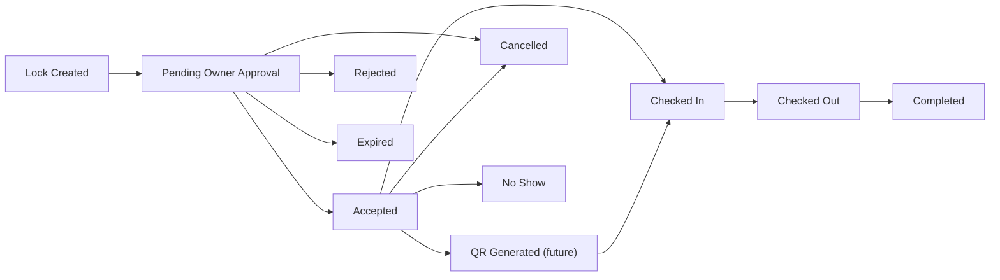

# Booking Engine Core

Module 02 Sequence 03 adds the backend foundation for booking locks, availability conflict checks, booking creation, owner approval, room assignment, lifecycle history, and occupancy status transitions.

This sequence does not implement QR generation, QR scanning, digital guest register, notifications, analytics, payments, or frontend screens.

## Lifecycle



## Booking Lock Workflow

1. Pilgrim calls `POST /api/bookings/lock` with lodge, room type, and date range.
2. Backend verifies the lodge is active and verified.
3. Backend verifies the room type is active.
4. Backend checks room availability against blocked room statuses, overlapping active bookings, and active unexpired locks.
5. Backend creates a 5-minute lock by default.
6. Pilgrim calls `POST /api/bookings` with the lock code and guest details.
7. Backend consumes the lock and creates a `PENDING_OWNER_APPROVAL` booking.

Lock duration is controlled by `BOOKING_LOCK_TTL_SECONDS`.

## Availability Rules

A room is unavailable when:

- Room status is `OCCUPIED`, `MAINTENANCE`, or `BLOCKED`.
- A booking with an active status overlaps the requested dates.
- An active unexpired booking lock overlaps the requested dates.

Overlap rule:

```text
new_check_in < existing_check_out
new_check_out > existing_check_in
```

## Owner Approval

Owners can manage only bookings for assigned lodges. Admins and super admins can manage all lodge bookings.

When accepted:

- Booking status becomes `ACCEPTED`.
- A physical room is assigned if one was not already selected.
- Room status becomes `CONFIRMED`.
- Booking history and room status history entries are recorded.

When rejected:

- Booking status becomes `REJECTED`.
- Rejection reason is stored.
- Booking history is recorded.

## Room Assignment

If a booking does not already have a room, acceptance assigns the first available room in deterministic order:

1. Lowest floor
2. Lowest room number

If no room is available at acceptance time, the booking remains pending and the API returns a conflict.

## Privacy Rules

Before owner acceptance, owner-facing booking responses hide full guest contact details. Owners can see:

- Guest name
- Guest count
- Room type
- Dates
- Special request

Full contact details become visible after `ACCEPTED`. Admins and the pilgrim who owns the booking can see full details.

## APIs

| Method  | Path                                                       | Auth        | Purpose                          |
| ------- | ---------------------------------------------------------- | ----------- | -------------------------------- |
| `POST`  | `/api/bookings/lock`                                       | User        | Create short booking lock        |
| `POST`  | `/api/bookings`                                            | User        | Create booking from valid lock   |
| `GET`   | `/api/bookings/my`                                         | User        | List current pilgrim bookings    |
| `GET`   | `/api/bookings/:id`                                        | User        | View booking by permission       |
| `GET`   | `/api/owner/bookings`                                      | Owner/Admin | List owner-visible bookings      |
| `POST`  | `/api/owner/bookings/:id/accept`                           | Owner/Admin | Accept booking and assign room   |
| `POST`  | `/api/owner/bookings/:id/reject`                           | Owner/Admin | Reject booking with reason       |
| `GET`   | `/api/admin/bookings`                                      | Admin       | List all bookings with filters   |
| `PATCH` | `/api/admin/bookings/:id/status`                           | Admin       | Controlled support status update |
| `GET`   | `/api/lodges/:lodgeId/room-types/:roomTypeId/availability` | Public      | Check room type availability     |

## Scheduled Cleanup

The booking module prepares an in-process scheduler for MVP cleanup:

- Expire active locks after `expiresAt`.
- Expire pending bookings after `ownerResponseDeadline`.

The interval is controlled by `BOOKING_SCHEDULER_INTERVAL_SECONDS`.

## QR Integration Note

Service-level methods exist for future QR integration:

- `ACCEPTED` to `CHECKED_IN`
- `CHECKED_IN` to `CHECKED_OUT`
- `CHECKED_OUT` to `COMPLETED`

No QR APIs are exposed in this sequence.

## Environment Variables

| Variable                                  | Default | Purpose                             |
| ----------------------------------------- | ------- | ----------------------------------- |
| `BOOKING_LOCK_TTL_SECONDS`                | `300`   | Lock validity window                |
| `BOOKING_OWNER_RESPONSE_DEADLINE_SECONDS` | `120`   | Owner response deadline             |
| `BOOKING_COMMISSION_FLAT_AMOUNT`          | none    | Optional flat commission foundation |
| `BOOKING_SCHEDULER_INTERVAL_SECONDS`      | `60`    | Cleanup interval                    |

## Future Work

- Add QR generation and scanning.
- Add digital guest register.
- Add notification events for booking lifecycle changes.
- Add payment and settlement workflow.
- Add frontend booking, owner approval, and admin support screens.
- Add focused integration tests for conflict prevention and lifecycle transitions.
