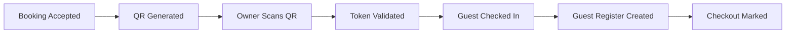

# QR Check-in and Guest Register Core

Module 02 Sequence 04 adds secure QR generation, QR validation, single-use check-in, checkout, and digital guest register foundations.

This sequence does not implement notifications, analytics, payments, WhatsApp, frontend screens, or ID image uploads.

## QR Lifecycle

QR tokens can be:

- `ACTIVE`
- `USED`
- `EXPIRED`
- `REVOKED`

## QR Security Rules

- Raw QR tokens are returned only once during generation.
- Only SHA-256 token hashes are stored.
- QR payloads contain booking identity, token, expiry, and token version only.
- Guest phone numbers, addresses, ID numbers, and other sensitive details are never placed in QR payloads.
- One active QR token is allowed per booking.
- A token becomes invalid immediately after successful scan.
- Every scan attempt is logged, including failed scans.

## Check-in Flow

1. Owner or admin generates QR for an `ACCEPTED` booking.
2. Owner scans QR through `POST /api/qr/scan`.
3. Backend validates token status, expiry, booking status, lodge verification, and owner-lodge access.
4. Backend marks token `USED`.
5. Booking moves to `CHECKED_IN`.
6. Room moves to `OCCUPIED`.
7. Digital guest register is created from booking details.
8. Booking history, room status history, QR scan log, and register audit log are recorded.
9. Owner receives unlocked booking/register details.

## Checkout Flow

Owner or admin calls `POST /api/owner/register/:id/checkout`.

The backend:

- Sets register status to `CHECKED_OUT`.
- Sets register `actualCheckoutAt`.
- Sets booking status to `CHECKED_OUT`.
- Sets booking `checkedOutAt`.
- Marks room `AVAILABLE` unless it is already `MAINTENANCE` or `BLOCKED`.
- Records room status history, booking history, and register audit log.

## Digital Guest Register

Registers are created only after successful QR check-in. Each register stores booking, lodge, room, guest, check-in, expected checkout, ID verification, and owner notes data.

Register search supports:

- Lodge
- Status
- Date
- Room number
- Guest name
- Phone
- Booking code
- Pagination

## Sensitive Data Visibility

Before QR check-in, owner-facing booking views stay limited. After QR check-in, assigned lodge owners and admins can view full register details including guest contact and address fields.

Sensitive detail access through register detail APIs creates a `DETAILS_VIEWED` audit entry.

## APIs

| Method  | Path                                  | Auth        | Purpose                                  |
| ------- | ------------------------------------- | ----------- | ---------------------------------------- |
| `POST`  | `/api/bookings/:id/qr/generate`       | Owner/Admin | Generate one-time QR token               |
| `GET`   | `/api/bookings/:id/qr`                | User/Admin  | View active QR metadata, never raw token |
| `POST`  | `/api/qr/scan`                        | Owner/Admin | Validate QR and check guest in           |
| `GET`   | `/api/owner/register`                 | Owner/Admin | List assigned lodge registers            |
| `GET`   | `/api/owner/register/:id`             | Owner/Admin | View register details and audit the view |
| `PATCH` | `/api/owner/register/:id/id-verified` | Owner/Admin | Mark ID details verified                 |
| `PATCH` | `/api/owner/register/:id/notes`       | Owner/Admin | Update owner notes                       |
| `POST`  | `/api/owner/register/:id/checkout`    | Owner/Admin | Mark checkout                            |
| `GET`   | `/api/admin/register`                 | Admin       | List all register entries                |

## Environment Variables

| Variable                                  | Default | Purpose                              |
| ----------------------------------------- | ------- | ------------------------------------ |
| `BOOKING_QR_TOKEN_TTL_SECONDS`            | `86400` | QR validity window                   |
| `BOOKING_SHOW_OWNER_PHONE_AFTER_ACCEPTED` | `false` | Future privacy toggle for owner view |

## Future Notification Integration

Sequence 05 can attach notification and real-time events to:

- QR generated
- QR scan succeeded
- QR scan failed
- Check-in completed
- Checkout completed
- Register details viewed
